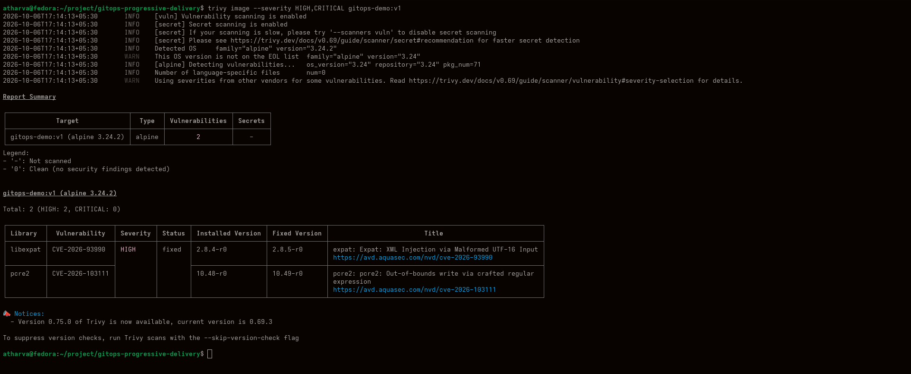
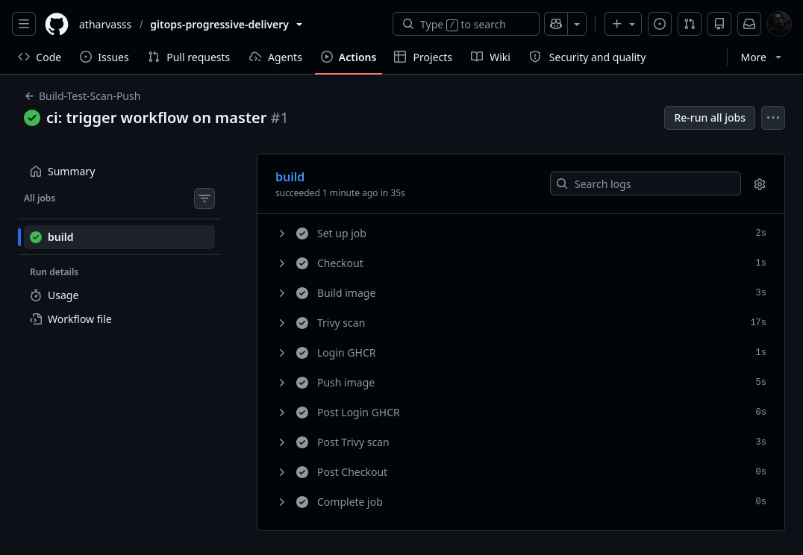
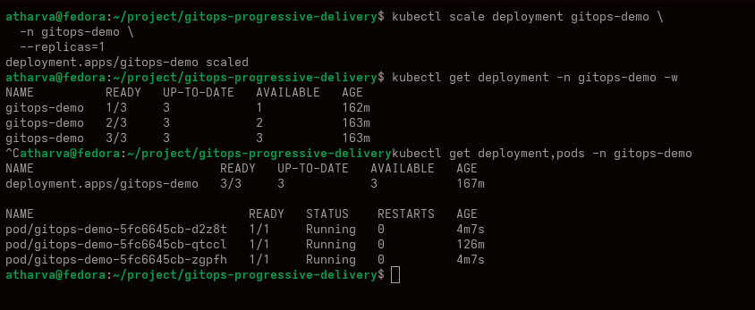
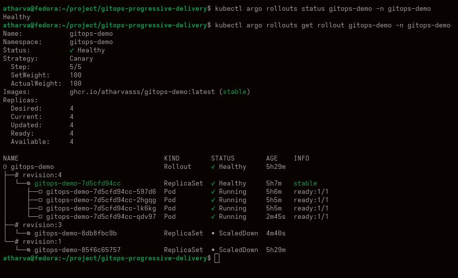

# GitOps-Based Kubernetes Deployment & Progressive Delivery Platform

GitOps CI/CD platform using GitHub Actions, Docker, Trivy, Helm, Argo CD and Kubernetes.

## Architecture

GitHub → GitHub Actions → Docker → Trivy → GHCR → Argo CD → Kubernetes → Progressive Delivery

## Features

- GitOps deployment
- Automated CI/CD
- Docker image builds
- Trivy security scanning
- GHCR image registry
- Argo CD synchronization
- Self-healing
- Canary deployments
- Rollback
- Kubernetes

## GitOps Flow

### 1. Application Build & CI/CD Pipeline

Developer pushes code and GitHub Actions automatically builds the application container image.

**GitHub Actions pipeline showing the automated build and delivery workflow.**  
This demonstrates the CI/CD stage where application changes are processed before being deployed to the Kubernetes environment.

### 2. Container Security Scanning

The container image is scanned for known vulnerabilities before being promoted for deployment.

**Trivy security scan validating the container image before deployment.**  
This adds a security gate to the delivery pipeline and helps identify known image vulnerabilities before the release reaches Kubernetes.

### 3. Container Image Published to GHCR

After the build and security checks, the container image is published to GitHub Container Registry.

**Container image available in GitHub Container Registry (GHCR).**  
GHCR acts as the image registry from which the Kubernetes deployment can retrieve the application image.

### 4. Argo CD GitOps Synchronization

Argo CD continuously compares the desired state stored in Git with the actual state running in Kubernetes.

**Argo CD showing the GitOps application and Kubernetes synchronization state.**  
This demonstrates how the Git repository becomes the source of truth for the Kubernetes deployment.

### 5. Kubernetes Deployment

The desired application state is synchronized and deployed into the Kubernetes cluster.

**Kubernetes workload running after GitOps deployment.**  
This confirms that the application defined through the GitOps workflow has been deployed successfully into the cluster.

## Failure Scenarios

### 6. Progressive Delivery & Rollout Failure

A bad release is introduced to demonstrate how the progressive delivery workflow handles an unhealthy deployment.

**Progressive rollout demonstrating release validation and failure handling.**  
The rollout can be monitored and controlled during deployment, allowing an unhealthy release to be stopped before it fully replaces the healthy version.

### 7. Rollback completed — stable revision restored and rollout healthy

The failed release is aborted or rolled back to restore the previously working application version.

**Rollback restoring the application to a known-good version.**  
This demonstrates the recovery path of the deployment workflow and validates that a failed release can be safely reverted.

## GitOps Flow

1. Developer pushes code
2. GitHub Actions builds image
3. Trivy scans image
4. Image pushed to GHCR
5. Argo CD detects desired state
6. Kubernetes deployment occurs
7. Progressive rollout validates release

## Failure Scenarios

- Manual replica modification
- Bad release
- Rollout abort
- Rollback

## Technologies

Kubernetes, Argo CD, Argo Rollouts, Docker, Helm, GitHub Actions, Trivy
